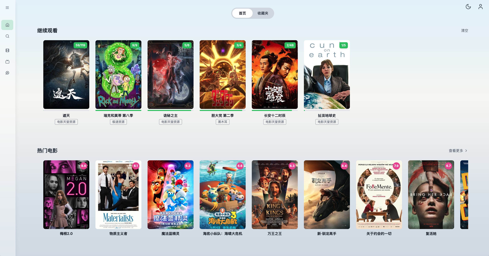

<div align="center">
  

  <h1>LunaTV</h1>
  <p><strong>為繁體中文使用者優化的自架影音聚合平台</strong></p>
  <p>多源搜尋・陸源譯名橋接・集數追更・無廣告 HLS・IPTV 直播・雲端進度同步</p>


</div>

LunaTV 是可自架的影音**聚合播放殼**：它本身**不提供、不託管、不儲存任何影片內容**。  
你把自己合法可用的 CMS/VOD API（與可選的 IPTV 直播源）接進來後，它負責把整條體驗串起來——

**搜得到 → 跟得上集 → 播得穩 → 進度不丟 → 源可管**

本倉庫是 [MoonTechLab/LunaTV](https://github.com/MoonTechLab/LunaTV) 的二次開發版本，在保留上游「空殼聚合器」定位的同時，針對**繁體中文使用者**與**播放穩定**做了加深。建議部署在 **2 核 4GB 以上**的機器。

| 方向     | 本 fork 強化重點                                                     |
| -------- | -------------------------------------------------------------------- |
| 在地化   | 繁中介面、繁簡搜尋、台灣／區域片名 → 陸源標題橋接、Bangumi 別名      |
| 追劇     | 播放中背景刷新詳情、最後一集強制確認新集、集數更新提示               |
| 片源治理 | 三級檢測（可搜／可解／可播）、熔斷與健康頁、一鍵重置（不自動亂關源） |
| 安全     | 寫入 API HMAC 驗簽、SSRF 防護、備份加密、管理端點獨立驗簽            |
| 工程     | Next.js 16 / React 19、核心單元測試、multi-arch Docker CI            |

> [!IMPORTANT]
> **部署後預設為空殼。** 沒有內建播放源／直播源，也不會憑空出現片庫。  
> 必須由部署者自行設定合法可用的來源；來源的合法性、安全性與可用性由部署者負責。  
> 請設定強密碼，僅供個人／小範圍使用，不要公開分享實例連結。

<details>
  <summary>點此查看專案截圖</summary>
  
  
  
</details>

## 目錄

- [功能特色](#功能特色)
- [與上游的差異（為什麼用這份）](#與上游的差異為什麼用這份)
- [系統架構](#系統架構)
- [部署](#部署)
  - [方式選哪一種](#方式選哪一種)
  - [Docker Compose + Kvrocks（推薦）](#docker-compose--kvrocks推薦)
  - [Docker Compose + Redis](#docker-compose--redis)
  - [Vercel + Upstash](#vercel--upstash)
  - [更新映像](#更新映像)
- [第一次使用](#第一次使用)
- [客戶端（Selene／Selene-TV）](#客戶端seleneselene-tv)
- [播放源與設定檔](#播放源與設定檔)
- [環境變數](#環境變數)
- [本機開發](#本機開發)
- [管理與維運](#管理與維運)
- [工程品質](#工程品質)
- [安全與合規](#安全與合規)
- [常見問題](#常見問題)
- [致謝](#致謝)
- [License](#license)

## 功能特色

### 搜尋與探索

- **多源聚合搜尋**：一次查詢已啟用 CMS/VOD 來源，串流輸出、去重與來源排序；快取保留完整播放清單（與上游一致），長劇進播放頁即可選集
- **網格／列表視圖**：搜尋結果可切換並記住；列表方便對片源與集數，滾動位置依關鍵字還原
- **繁簡／陸源智慧匹配**：繁簡轉換、長標題拆分、季數／Part 解析、hybrid 模糊匹配
- **台灣片名橋接**：搜尋落空時可走豆瓣／區域別名／Bangumi 等路徑，提高「台譯 → 陸源」命中率
- **豆瓣／Bangumi 探索**：電影、劇集、動漫（含每日放送）、綜藝分類瀏覽
- **來源熔斷**：連續逾時的來源暫時降權，避免壞源拖垮整次搜尋（可重置，不永久封殺）

### 播放與追劇

- **無廣告 HLS 播放**：ArtPlayer + hls.js；可在 M3U8 層過濾廣告切片
- **VOD 瀏覽器直連**：點播串流預設由瀏覽器直連 CDN（降低自架頻寬壓力，也較不易被源站依機房 IP 擋）
- **片源測速優選**：對候選源並行測速後排序，換源可接續進度
- **集數追更**：
  - 進播放頁會背景刷新最新詳情
  - 已在最後一集時按「下一集」，或開啟自動連播播完最後一集，會再向詳情 API 確認是否有新集
  - 有新集提示「已更新至第 N 集」；沒有則提示「目前仍是最新一集」
  - 刷新時可保留目前這一集的播放 URL，降低簽章 URL 輪替造成的中斷
- **追劇輔助**：跳過片頭片尾（可記憶）、選集正序／倒序（可記憶）、長按 2 倍速、自動連播倒數、斷點續播、快捷鍵與行動手勢
- **畫面比例與頂欄**：21:9／滿版裁切、全螢幕顯示片名與時鐘、控制列透明度
- **接著看**：首頁大圖區塊快速接續上次觀看

### IPTV 直播

- 匯入 M3U／M3U8 直播源、頻道分組
- XMLTV EPG 節目單（當日節目清洗、捲動跟隨）
- 直播相關串流走伺服器 proxy（處理 CORS／金鑰等），與 VOD 直連策略分離

### 資料同步與備份

- **四種儲存後端**：Kvrocks（推薦）／Redis／Upstash／localStorage
- 觀看紀錄、收藏、搜尋歷史、跳過片頭片尾設定可跨裝置同步（非 localStorage 模式）
- **Selene／Selene-TV**：可當 MoonTV v100 相容後端，進度與收藏與網頁共用同一組帳號
- 後台資料匯出／匯入；匯出備份支援強化保護（scrypt + AES-GCM）

### 管理後台

- 片源新增、拖曳排序、批次啟停
- **三級有效性檢測**：可搜尋／可解析集數／可抽樣播放
- 健康頁：儲存連線、cron、熔斷、搜尋延遲、最近三級檢測結果
- 一鍵重置健康／熔斷／最近檢測（**不改來源啟停**）
- 多使用者與角色、站點設定、設定檔訂閱

## 與上游的差異（為什麼用這份）

上游 LunaTV／MoonTV 的核心哲學是：

> 空殼、自架、Docker 優先、個人使用、主路徑好用。

本 fork **完整保留**這個定位，並把力氣花在繁中使用者真正痛的地方：

1. **搜得到陸源**（譯名、繁簡、別名，而不是只做字面搜尋）
2. **播得穩、選集齊**（搜尋快取與上游一樣保留完整播放清單；詳情刷新與最後一集確認）
3. **源站壞了知道是誰**（三級檢測與健康觀察，而不是整站搜尋變慢卻找不到原因）
4. **私人實例更耐用**（寫入 API 驗簽、SSRF、備份加密、CI）

若你需要的是「最貼近上游原版、簡中文件為主」的版本，請直接使用 [MoonTechLab/LunaTV](https://github.com/MoonTechLab/LunaTV)。  
若你要的是**繁中體驗 + 追劇可靠度 + 自架維運**，用本倉庫。

## 系統架構

```
┌─────────────────────────────────────────────────────┐
│                 Browser / PWA 客戶端                 │
│     Next.js UI · ArtPlayer · hls.js · 直連 VOD      │
└──────────────────────────┬──────────────────────────┘
                           │
┌──────────────────────────▼──────────────────────────┐
│              Next.js 16（Node.js 24）                 │
│  proxy 全域登入閘門 · API Routes · 內建 cron         │
│  搜尋聚合 · 詳情刷新 · 直播 proxy · 圖片代理         │
│  三級源檢測 · 熔斷/健康 · HMAC 寫入防護              │
└──────────────┬─────────────────────┬────────────────┘
               │                     │
       ┌───────▼───────┐     ┌───────▼────────┐
       │ 儲存後端       │     │ 你自己接的來源   │
       │ Kvrocks        │     │ CMS / VOD API   │
       │ Redis          │     │ M3U 直播源      │
       │ Upstash        │     │ 豆瓣 / Bangumi  │
       │ localStorage   │     │ （僅中繼資料）   │
       └───────────────┘     └────────────────┘
```

| 層面 | 技術                                               |
| ---- | -------------------------------------------------- |
| 框架 | Next.js 16（App Router）、React 19、TypeScript 5.9 |
| 樣式 | Tailwind CSS 3                                     |
| 播放 | ArtPlayer 5、hls.js                                |
| 認證 | 全域 proxy 閘門 + 簽名 Cookie；寫入 API 再驗 HMAC  |
| 儲存 | Kvrocks / Redis / Upstash / localStorage 同一介面  |
| 部署 | Docker multi-arch（amd64 / arm64）、GHCR 映像      |

## 部署

### 方式選哪一種

| 方式                         | 適合                                    | 儲存                  | 備註                         |
| ---------------------------- | --------------------------------------- | --------------------- | ---------------------------- |
| **Docker Compose + Kvrocks** | VPS／NAS 長期自架（建議 2 核 4GB 以上） | Kvrocks               | **最推薦**，資料落盤、成本低 |
| Docker Compose + Redis       | 已有 Redis 環境                         | Redis                 | 記得開 AOF／持久化           |
| Vercel + Upstash             | 不想管機器                              | Upstash               | 需設定 `CRON_SECRET`         |
| 本機 `pnpm dev`              | 開發除錯                                | localStorage 或 Redis | 不建議當正式站               |

> 映像位址：`ghcr.io/berserker8888/lunatv:latest`  
> 版本標籤可改為 `3.5.1` 或你需要的 tag。

### Docker Compose + Kvrocks（推薦）

建立 `docker-compose.yml`：

```yaml
services:
  lunatv:
    image: ghcr.io/berserker8888/lunatv:latest
    container_name: lunatv
    restart: unless-stopped
    ports:
      - '3000:3000'
    environment:
      - USERNAME=admin
      - PASSWORD=請改成夠長的強密碼
      - STORAGE_TYPE=kvrocks
      - NEXT_PUBLIC_STORAGE_TYPE=kvrocks
      - KVROCKS_URL=redis://kvrocks:6666
      - NEXT_PUBLIC_SITE_NAME=LunaTV
      # 可選
      # - ANNOUNCEMENT=歡迎使用
      # - SITE_BASE=https://tv.example.com
    depends_on:
      - kvrocks
    networks:
      - lunatv

  kvrocks:
    image: apache/kvrocks:latest
    container_name: lunatv-kvrocks
    restart: unless-stopped
    volumes:
      - kvrocks-data:/var/lib/kvrocks
    networks:
      - lunatv

networks:
  lunatv:

volumes:
  kvrocks-data:
```

```bash
docker compose up -d
# 瀏覽器開啟 http://你的主機:3000
# 使用 USERNAME / PASSWORD 登入

# 之後更新
docker compose pull
docker compose up -d
```

說明：

- 容器內建 `HEALTHCHECK`（探測 `/api/health`）
- Docker 啟動腳本會帶內建 cron，定期做維運工作（含追蹤中內容的更新流程）
- **兩個服務必須在同一 Docker network**，`KVROCKS_URL` 主機名用 compose service 名（上例是 `kvrocks`）

### Docker Compose + Redis

```yaml
services:
  lunatv:
    image: ghcr.io/berserker8888/lunatv:latest
    container_name: lunatv
    restart: unless-stopped
    ports:
      - '3000:3000'
    environment:
      - USERNAME=admin
      - PASSWORD=請改成夠長的強密碼
      - STORAGE_TYPE=redis
      - NEXT_PUBLIC_STORAGE_TYPE=redis
      - REDIS_URL=redis://redis:6379
      - NEXT_PUBLIC_SITE_NAME=LunaTV
    depends_on:
      - redis

  redis:
    image: redis:7-alpine
    restart: unless-stopped
    command: redis-server --appendonly yes
    volumes:
      - redis-data:/data

volumes:
  redis-data:
```

### Vercel + Upstash

適合不想維護 VPS 的個人部署：

1. Fork 本倉庫，在 [Vercel](https://vercel.com) 匯入
2. 建立 [Upstash Redis](https://upstash.com/) 資料庫，取得 REST URL 與 TOKEN
3. 在 Vercel 專案設定環境變數：

```env
USERNAME=admin
PASSWORD=你的強密碼
STORAGE_TYPE=upstash
NEXT_PUBLIC_STORAGE_TYPE=upstash
UPSTASH_URL=https://xxxx.upstash.io
UPSTASH_TOKEN=你的_token
CRON_SECRET=自訂一串夠長的隨機字串
NEXT_PUBLIC_SITE_NAME=LunaTV
```

4. 部署完成後用 Vercel 網域登入
5. 專案內 `vercel.json` 會觸發排程呼叫 cron；**請務必設定 `CRON_SECRET`**

### 更新映像

```bash
# Docker Compose
docker compose pull
docker compose up -d

# 查看目前版本
# 登入後開啟版本面板，或看映像 tag / 健康頁 version 欄位
```

也可搭配 Watchtower 等工具自動拉新映像（仍建議先在測試環境驗證）。

## 第一次使用

1. 用 `USERNAME` / `PASSWORD` 登入
2. 進入 **管理面板**
3. 到 **影片來源** 新增加法 CMS API（或貼設定檔／訂閱遠端設定）
4. 用 **三級有效性檢測** 確認來源至少「可搜」，理想是「可搜／可解／可播」
5. 回首頁或搜尋頁試搜一部你知道存在的片子
6. 進播放頁確認能播；連載片可跳到最後一集測「下一集／追更」
7. （可選）到 **健康頁** 看儲存、cron、熔斷與最近檢測

若登入後是警告頁：代表 `PASSWORD` 未設定或未正確注入環境變數。

## 客戶端（Selene／Selene-TV）

這份後端對齊 [MoonTV v100](https://github.com/MoonTechLab/LunaTV) 客戶端協定，可直接給官方 App 當伺服器，不必把 App 揉進網頁。

| 客戶端                                                | 平台                         | 下載            |
| ----------------------------------------------------- | ---------------------------- | --------------- |
| [Selene](https://github.com/MoonTechLab/Selene)       | Android／iOS／macOS／Windows | GitHub Releases |
| [Selene-TV](https://github.com/MoonTechLab/Selene-TV) | Android TV（遙控器）         | GitHub Releases |

設定步驟：

1. 後端請用 **Kvrocks／Redis／Upstash**（`localStorage` 模式無法跨裝置同步）
2. 在 App 填 **伺服器地址**：`https://你的網域`（含協定，不要加 `/api`，不要結尾斜線）
3. 帳號密碼用站長 `USERNAME`／`PASSWORD`，或後台建立的使用者
4. 連線探測走公開的 `/api/health`；登入後 cookie `auth` 會同步搜尋、詳情、播放紀錄、收藏、搜尋歷史、直播源列表
5. 直播：App 在裝置上直連源站。後台「啟用網頁直播」只影響瀏覽器直播頁與直播 proxy，關了也不擋 Selene 拉源列表

注意：

- 豆瓣首頁、Bangumi 日曆由 App 自己打外部 API，不經本站
- 寫入 API 仍驗登入簽章；沒有為客戶端放寬 CORS／SSRF／HMAC
- 請只給自己的實例使用，不要公開分享登入連結

## 播放源與設定檔

本專案**不附來源**。請只接入你有權使用的 API。

支援常見蘋果 CMS（maccms）風格介面。設定方式：

1. **後台逐筆新增**：管理面板 → 影片來源
2. **設定檔貼上**：管理面板 → 設定檔
3. **訂閱網址**：遠端 JSON，可自動更新
4. **檔案掛載**：容器內 `config.json`，或以 `CONFIG_FILE_PATH` 指定

最小示例：

```json
{
  "cache_time": 7200,
  "api_site": {
    "example": {
      "api": "https://example.com/api.php/provide/vod",
      "name": "示例資源",
      "detail": "https://example.com"
    }
  }
}
```

直播源在後台 **直播來源** 管理（M3U URL、可選 UA／EPG）。

### 搜尋排序（可選）

管理面板 → 站點設定 → **搜尋時優先使用檢測較佳的源**（預設關閉）。
開啟後只調整搜尋順序，**不會自動停用**任何來源。

### 三級檢測怎麼看

| 結果                 | 含義                            | 建議                     |
| -------------------- | ------------------------------- | ------------------------ |
| 可播（valid）        | 能搜、能解析集數、m3u8 抽樣成功 | 優先使用                 |
| 部分通過（partial）  | 通常是能搜但詳情或播放抽樣失敗  | 可留著當備援，觀察       |
| 無結果（no_results） | API 通但關鍵詞沒命中            | 換個關鍵詞再測           |
| 無效（invalid）      | 連線／協定失敗                  | 檢查 URL、網路、源站狀態 |

> 檢測**不會**因為失敗就自動禁用來源，避免誤傷不穩定但可用的陸源。

## 環境變數

### 必填／核心

| 變數                            | 必填         | 說明                                                                                                                                                |
| ------------------------------- | ------------ | --------------------------------------------------------------------------------------------------------------------------------------------------- |
| `USERNAME`                      | 是           | 站長帳號                                                                                                                                            |
| `PASSWORD`                      | 是           | 站長密碼（請用強密碼）                                                                                                                              |
| `SESSION_SECRET`                | 多使用者建議 | 會話 HMAC 密鑰；未設時回退 `PASSWORD`（改密碼會使所有 session 失效，開機會 warning）                                                                |
| `STORAGE_TYPE`                  | 強烈建議     | `kvrocks` / `redis` / `upstash` / `localstorage`                                                                                                    |
| `NEXT_PUBLIC_STORAGE_TYPE`      | 強烈建議     | 須與 `STORAGE_TYPE` 一致                                                                                                                            |
| `KVROCKS_URL`                   | kvrocks 時   | 例：`redis://kvrocks:6666`                                                                                                                          |
| `REDIS_URL`                     | redis 時     | 例：`redis://redis:6379`                                                                                                                            |
| `UPSTASH_URL` / `UPSTASH_TOKEN` | upstash 時   | Upstash REST 憑證                                                                                                                                   |
| `CRON_SECRET`                   | Vercel 必填  | 保護 `/api/cron`                                                                                                                                    |
| `NEXT_PUBLIC_SITE_NAME`         | 否           | 站名（預設 LunaTV）                                                                                                                                 |
| `ANNOUNCEMENT`                  | 否           | 公告                                                                                                                                                |
| `SITE_BASE`                     | 否           | 公開站台 URL（部分回呼／連結場景；https 且 host 對得上時也會讓登入 cookie 加 Secure）                                                               |
| `COOKIE_SECURE`                 | 否           | 強制登入 cookie 的 Secure 屬性（`true` / `false`）。未設時依請求協定與 `SITE_BASE` 判斷，不再綁 `NODE_ENV`，因此 `http://192.168.x.x:3000` 也能登入 |
| `TRUST_PROXY`                   | 否           | 設 `true` 才採信 `X-Forwarded-For`／`X-Real-IP` 做限流。直連 `3000:3000` 不要開，否則客戶端可輪換標頭繞過登入／API 限流                             |

### 常用進階

| 變數                                  | 預設                    | 說明                                        |
| ------------------------------------- | ----------------------- | ------------------------------------------- |
| `CONFIG_FILE_PATH`                    | `./config.json`         | 初始設定檔路徑                              |
| `NEXT_PUBLIC_SEARCH_MAX_PAGE`         | `5`                     | 舊設定：搜尋現已固定只打第 1 頁，此值不生效 |
| `NEXT_PUBLIC_FLUID_SEARCH`            | `true`                  | 串流搜尋（邊搜邊顯示）                      |
| `NEXT_PUBLIC_DISABLE_YELLOW_FILTER`   | `false`                 | 停用成人分類過濾                            |
| `NEXT_PUBLIC_DOUBAN_PROXY_TYPE`       | `cmliussss-cdn-tencent` | 豆瓣資料代理策略                            |
| `NEXT_PUBLIC_DOUBAN_IMAGE_PROXY_TYPE` | `cmliussss-cdn-tencent` | 豆瓣圖片代理策略                            |
| `BANGUMI_ACCESS_TOKEN`                | —                       | 提高 Bangumi 別名查詢額度                   |
| `SEARCH_CACHE_TTL_MINUTES`            | `120`                   | 伺服器搜尋快取（含完整集數清單）            |
| `SEARCH_SOURCE_CONCURRENCY`           | `12`                    | 同時搜幾條源（1–24）                        |
| `SEARCH_OUTBOUND_CAP`                 | `32`                    | 搜尋同時打 CMS 上限                         |
| `SEARCH_SUCCESS_SOURCE_CUTOFF`        | `64`                    | 前 K 個有結果源後截止                       |
| `SEARCH_DEADLINE_MS`                  | `20000`                 | 單次搜尋總時限（毫秒）                      |
| `SEARCH_HOT_PATH_MAX_VARIANTS`        | `3`                     | 每個源最多打幾個查詢變體                    |
| `SEARCH_PAGE_TIMEOUT_MS`              | `5000`                  | 單頁 CMS 逾時（毫秒）                       |
| `SOURCE_BREAKER_THRESHOLD`            | `3`                     | 熔斷：連續失敗次數                          |
| `SOURCE_BREAKER_COOLDOWN_MINUTES`     | `10`                    | 熔斷冷卻分鐘                                |

## 本機開發

需求：Node.js ≥ 20.9（建議 24）、pnpm ≥ 10。

```bash
pnpm install
pnpm dev          # http://localhost:3000
pnpm build
pnpm lint
pnpm typecheck
pnpm test
pnpm test:e2e
```

開發時可先用：

```env
USERNAME=admin
PASSWORD=admin
NEXT_PUBLIC_STORAGE_TYPE=localstorage
STORAGE_TYPE=localstorage
```

正式環境請改用 Kvrocks／Redis／Upstash，不要用 localStorage 當多人站。

專案結構：

```
src/
├── app/           # 頁面與 API（play / live / admin / search ...）
├── components/    # UI
├── hooks/         # React hooks
└── lib/           # 搜尋、儲存、繁簡、安全、源檢測等核心邏輯
```

## 管理與維運

| 場景           | 建議動作                                             |
| -------------- | ---------------------------------------------------- |
| 搜尋突然變慢   | 健康頁看熔斷與延遲；對可疑源做三級檢測               |
| 某源能搜不能播 | 看檢測的「解／播」；可能是詳情格式或 CDN 暫時失敗    |
| 連載沒有新集   | 播放頁跳到最後一集再按下一集；確認 detail API 正常   |
| 想清熔斷狀態   | 後台「重置健康狀態」或健康頁重置（不改啟停）         |
| 換機器搬遷     | 後台匯出備份 → 新站匯入                              |
| 升級版本       | `docker compose pull && up -d`，再看版本面板／健康頁 |

## 工程品質

- TypeScript strict、ESLint flat config、React hooks 嚴格規則
- Jest 測搜尋、播放與安全核心；Playwright 覆蓋登入與主要流程
- husky + lint-staged + commitlint；介面用語維持繁體中文
- GitHub Actions：lint / typecheck / test / e2e 通過後推送 amd64+arm64 映像到 GHCR

## 安全與合規

- 本專案只提供**搜尋與播放介面**，不內建片庫
- 播放內容來自你自己設定的第三方來源；請遵守當地法律與來源條款
- 請使用強密碼，關閉不必要的公開暴露，勿把實例當公開片站宣傳
- 寫入型 API 會驗證登入簽章；管理端點另有權限與驗簽
- 代理層具備 SSRF 防護（阻擋內網位址）；VOD 仍以瀏覽器直連為主
- 因設定來源、公開分享、二次分發或部署所生風險，由使用者自行承擔

**不建議**在中國大陸主流社群平台公開宣傳此類自架聚合專案；請低調、自用、合法使用。

## 常見問題

**Q: 部署後什麼都沒有？**  
A: 正常。請到管理面板自己加源。

**Q: 搜尋有結果但播放失敗？**  
A: 先跑三級檢測。若「搜✓ 解✓ 播✗」，多半是該源 m3u8／CDN 問題，換源或稍後再試。

**Q: 選集只有 1 集、換源卻寫一千多集？**  
A: v3.3.0 起搜尋快取會留下完整播放清單。請拉最新映像並硬重新整理（Ctrl+F5）。若某個源詳情本身只有 1 條網址，換源即可。

**Q: 為什麼不強制所有影片走伺服器代理？**  
A: 會爆自架頻寬，也更容易被源站封鎖機房 IP。本專案 VOD 採瀏覽器直連、直播才走 proxy。

**Q: localStorage 模式能多使用者嗎？**  
A: 不適合。正式環境請用 Kvrocks／Redis／Upstash。

**Q: 和上游映像能混用嗎？**  
A: 不建議直接混 tag。本 fork 有自己的行為與版本線（目前 **3.5.1**）；資料結構多數相容，但升級前請先備份。

**Q: 有些源搜得到但黑屏？**  
A: v3.4.0 起，直連 CORS／網路失敗會自動改走站內 HLS 代理再播一次。平時仍走瀏覽器直連。若代理後仍失敗，畫面上可重試或自動切到下一個 1080p 源。

**Q: 更新映像後白屏、點了沒反應？**  
A: v3.4.0 會在舊 JS 檔失效時自動硬重新整理一次。若仍卡住，再手動 Ctrl+F5。

**Q: 換源後片頭片尾設定不見了？**  
A: v3.4.0 起跳過秒數綁片名／豆瓣 ID，同一部片換源會沿用。舊的「依來源」設定會在第一次讀到時自動帶過去。

**Q: 可以用 Selene 或 Selene-TV 連這台嗎？**  
A: 可以。v3.5.0 起對齊 MoonTV v100 客戶端 API。伺服器地址填站台根網址，帳號與網頁相同。詳見 [客戶端](#客戶端seleneselene-tv)。

**Q: 設了密碼還是進警告頁？**  
A: v3.5.1 起，`admin`／`123456` 這類常見弱密碼也會擋下。請把 `PASSWORD` 改成夠長且不好猜的值，然後重啟。

## 致謝

- 上游專案：[MoonTechLab/LunaTV](https://github.com/MoonTechLab/LunaTV)（及其歷史前身 MoonTV）
- 靈感與生態：[LibreTV](https://github.com/LibreSpark/LibreTV)
- 播放器：[ArtPlayer](https://github.com/zhw2590582/ArtPlayer)、[HLS.js](https://github.com/video-dev/hls.js)
- 豆瓣相關代理／CDN 方案貢獻者（Zwei、CMLiussss 等）
- 以及所有提供合法可接 API、提交 issue／PR 與測試回饋的使用者

## License

[CC BY-NC-SA 4.0](LICENSE)

- 姓名標示
- **非商業性**
- 相同方式分享

衍生作品須保留本專案與上游專案致謝，並以相同授權釋出。禁止商業用途。
